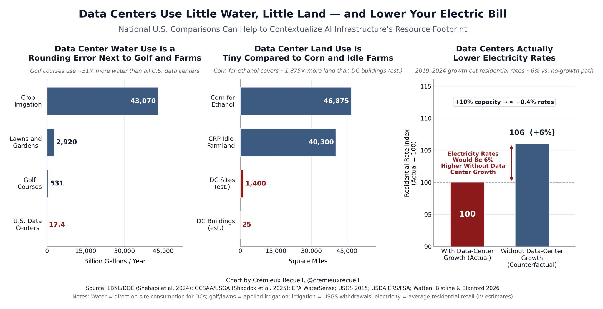
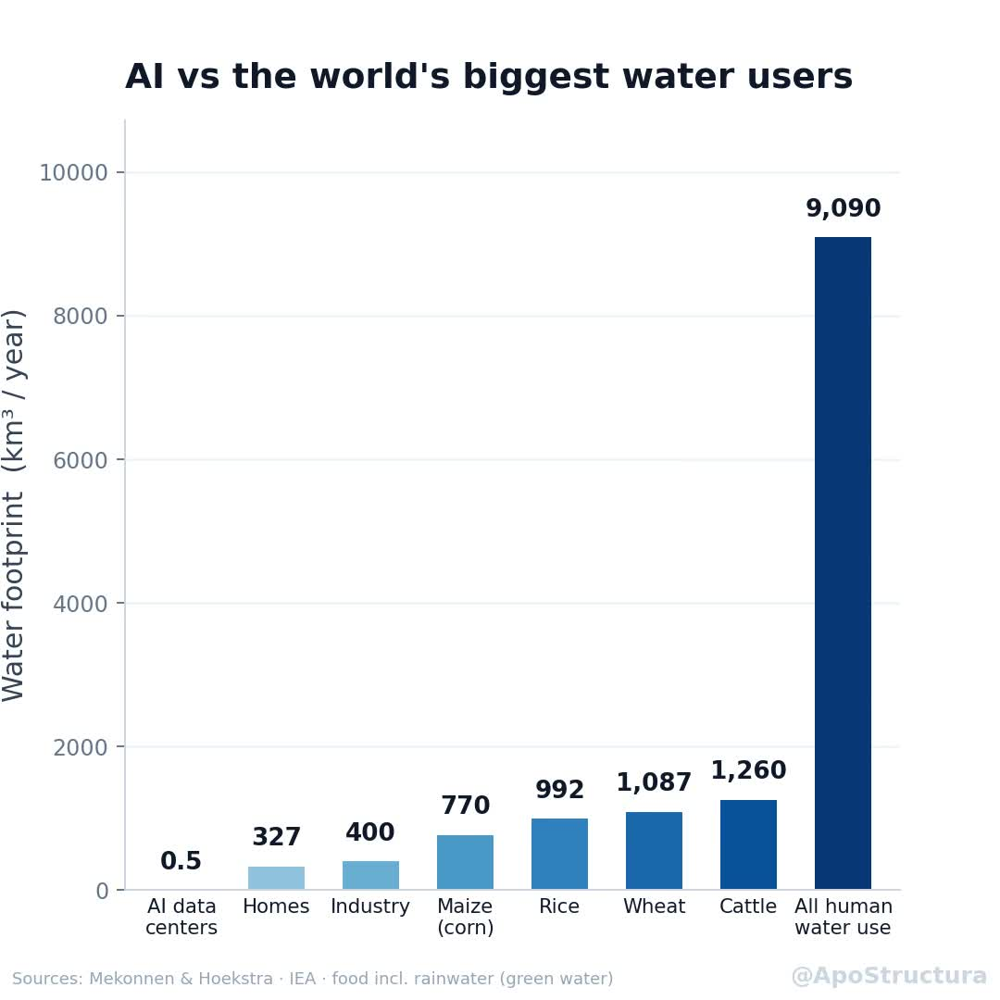

I don't enjoy having to repeat the same evidence every time, so I decided to put all of my answers here. If you don't care enough to read it, fine by me, but criticizing me while refusing to engage with the evidence is performative.

On the other hand, if you decide to read it, thank you for at least taking the time to do so, even if it's just out of hatred. My answers are backed by studies or evidence when possible, so if you decide to argue against them, the very least I expect is for you to be able to do the same (with a credible source, of course).

If you don't, I'm afraid I will probably just ignore you. If you do, and you actually present an argument that makes me change my mind, congratulations! We've had a productive conversation, something not as common nowadays, and our beliefs are probably not as far apart as you might initially think. Furthermore, I will present your argument and praise it somewhere on this page.

I love having productive discussions with people who challenge my beliefs. Sadly, this is not normally the case: a lot of the criticism I get comes from "hate mobs" that rarely present good arguments or understand the topic they choose to hate. If your knowledge of AI consists purely of TikTok and/or echo-chamber content, it is most likely contradicted by the answers below.

My replies will inevitably have some personal opinion behind them, but I will try to keep them as objective as possible. If you want to attack my philosophy, cool, but data is data, and neither your opinion nor mine changes it.

## My stance

For obvious reasons, I will only defend what I use and agree with, so I would like to specify my stance:

- I don't support or encourage the use of AI as an end product in creative fields (illustration, writing, music).

- I don't support or encourage the use of AI for the production of false real-life media (images, video).

- I support the use of AI in software engineering (coding).

Why? Isn't this a double standard? Simply because I don't consider *typing the code itself* to be the creative part of software engineering. For me, the creative work lies in the idea, product direction, architecture, and decisions. Code is just a means to that end. This is completely subjective, and I know some people disagree, which I respect. AI can help write the code without replacing my thought process, creative direction, review, testing, or responsibility for the result. You can argue that AI is good or bad at writing code, but that's a different discussion.

<h2 id="stolen-work-claims" class="claim-group">
  Generative AI is built on stolen work
  Using generative AI means benefiting from work stolen from artists
</h2>

The blanket claim that training data is "stolen work" collapses several different questions: whether a source was lawfully obtained, whether training on it is permitted under the applicable copyright law, and whether a model reproduces protected expression. It assumes that using a work to learn statistical patterns is equivalent to copying and redistributing the work as-is, when it isn't.<a id="cite-2b" href="#source-2" aria-label="Source 2">2</a>

Under U.S. copyright law, copyright protects a codebase's original expression, not the ideas, processes, systems, methods, concepts, or principles behind it.<a id="cite-1" href="#source-1" aria-label="Source 1">1</a> In *Bartz v. Anthropic*, the court held that the training use at issue was fair use while separately rejecting fair-use protection for Anthropic's permanent library of pirated books.<a id="cite-2" href="#source-2" aria-label="Source 2">2</a>

A lot of the people I see using this argument are artists. Being an artist does not, by itself, make someone an authority on how software tools are built. Art and code are both copyrightable expression,<a id="cite-1b" href="#source-1" aria-label="Source 1">1</a> but the two contexts are not interchangeable. Generated code still sits inside a system that has to be designed, integrated, reviewed, tested, maintained, and licensed. If you want to criticize my use of AI in software engineering, criticize that actual workflow instead of importing assumptions from image generation.

### Sources

<ol class="sources" start="1">
  <li id="source-1"><a href="https://www.law.cornell.edu/uscode/text/17/102">U.S. Congress, "17 U.S.C. Section 102: Subject Matter of Copyright: In General" (1976)</a>. <a class="source-backlink" href="#cite-1" aria-label="Back to citation 1">&larr;</a></li>
  <li id="source-2"><a href="https://copyrightalliance.org/wp-content/uploads/2025/06/Bartz-v.-Anthropic-Order.pdf">U.S. District Court for the Northern District of California, "Bartz v. Anthropic: Order on Fair Use" (2025)</a>. <a class="source-backlink" href="#cite-2" aria-label="Back to citation 2">&larr;</a></li>
</ol>

<h2 id="ai-water-claims" class="claim-group">
  AI and data centers consume enormous amounts of water and pollute local water supplies
  Data centers are ruining local communities by eating a ton of water and doubling energy prices
</h2>

The AI and data-center water argument is genuinely a *psyop* by the oil and gas industry to distract from the fact that they are the most problematic producers of energy.[<a id="cite-3" href="#source-3" aria-label="Source 3">3</a>, <a id="cite-4" href="#source-4" aria-label="Source 4">4</a>] One of the first widely circulated mainstream articles about it was published by [The Washington Post](https://www.washingtonpost.com/technology/2024/09/18/energy-ai-use-electricity-water-data-centers/).<a id="cite-5" href="#source-5" aria-label="Source 5">5</a>

There is a ton of misinformation in that article. For instance, the main data point presented is literally made up! It cites a UC Riverside paper that models GPT-3 and estimates about 16.9 ml per medium request, while explicitly stating that GPT-4's resource use was not publicly known.<a id="cite-6" href="#source-6" aria-label="Source 6">6</a> The Post supplied a separate, undisclosed GPT-4 estimate of 519 ml and 140 Wh per 100-word email, approximately 35 times and 31 times higher than the cited paper's actual energy and water estimates.<a id="cite-5b" href="#source-5" aria-label="Source 5">5</a> Later production measurements found approximately 0.24 Wh and 0.26 ml per median text prompt, making the initial data roughly 583x and 1,996x higher than the real measurements.<a id="cite-7" href="#source-7" aria-label="Source 7">7</a> The base of the argument is built on misinformation, just like everything that came afterward.

[This blog](https://blog.andymasley.com/p/the-ai-water-issue-is-fake) goes much more in-depth into it than I will in this answer. If you're genuinely interested in the "water problem," go read it.

[Andy Masley's analysis](https://blog.andymasley.com/p/the-ai-water-issue-is-fake) separates direct data-center cooling from indirect water used by power plants, arguing that much of the reported AI water footprint comes from electricity generation, not the data centers themselves. The Lawrence Berkeley National Laboratory makes the same distinction and estimates that, across all U.S. data centers in 2023, indirect water consumption was nearly 800 billion liters versus 66 billion liters of direct consumption.<a id="cite-8" href="#source-8" aria-label="Source 8">8</a> Masley argues that data centers are not a notable source of water-quality pollution; an EPA case study documents cooling-water treatment, recycling, and closed-loop reuse at a Microsoft facility.<a id="cite-9" href="#source-9" aria-label="Source 9">9</a>

Meanwhile, the EPA identifies agricultural runoff as the leading cause of water-quality impacts to U.S. rivers and streams,<a id="cite-10" href="#source-10" aria-label="Source 10">10</a> while construction runoff is recognized as a significant source of sediment and other pollutants.<a id="cite-11" href="#source-11" aria-label="Source 11">11</a>

<figure>
  
  <figcaption>Data-center water use, land use, and modeled electricity-rate comparisons.[<a id="cite-12" href="#source-12" aria-label="Source 12">12</a>, <a id="cite-13" href="#source-13" aria-label="Source 13">13</a>, <a id="cite-14" href="#source-14" aria-label="Source 14">14</a>, <a id="cite-15" href="#source-15" aria-label="Source 15">15</a>, <a id="cite-16" href="#source-16" aria-label="Source 16">16</a>, <a id="cite-17" href="#source-17" aria-label="Source 17">17</a>, <a id="cite-18" href="#source-18" aria-label="Source 18">18</a>] The site and building-footprint figures are the chart author's estimates. [Chart by Cremieux Recueil](https://pbs.twimg.com/media/HNiC5kIWgAAMylA?format=jpg&amp;name=orig).</figcaption>
</figure>

<figure>
  
  <figcaption>Annual water-footprint comparison.[<a id="cite-19" href="#source-19" aria-label="Source 19">19</a>, <a id="cite-20" href="#source-20" aria-label="Source 20">20</a>, <a id="cite-21" href="#source-21" aria-label="Source 21">21</a>, <a id="cite-22" href="#source-22" aria-label="Source 22">22</a>] The IEA figure covers all data centers, not only AI data centers, and the food bars use a broader water-footprint method. [Chart by ApoStructura](https://x.com/ApoStructura/status/2070238964452089858).</figcaption>
</figure>

### Sources

<ol class="sources" start="3">
  <li id="source-3"><a href="https://www.ipcc.ch/report/ar6/wg3/chapter/chapter-6/">Intergovernmental Panel on Climate Change, "Climate Change 2022: Mitigation of Climate Change, Chapter 6: Energy Systems" (2022)</a>. <a class="source-backlink" href="#cite-3" aria-label="Back to citation 3">&larr;</a></li>
  <li id="source-4"><a href="https://www.who.int/health-topics/air-pollution">World Health Organization, "Air Pollution" (n.d.)</a>. <a class="source-backlink" href="#cite-4" aria-label="Back to citation 4">&larr;</a></li>
  <li id="source-5"><a href="https://www.washingtonpost.com/technology/2024/09/18/energy-ai-use-electricity-water-data-centers/">The Washington Post, "A Bottle of Water per Email: The Hidden Environmental Costs of Using AI Chatbots" (2024)</a>. <a class="source-backlink" href="#cite-5" aria-label="Back to citation 5">&larr;</a></li>
  <li id="source-6"><a href="https://arxiv.org/abs/2304.03271">Pengfei Li et al., "Making AI Less 'Thirsty': Uncovering and Addressing the Secret Water Footprint of AI Models" (2023)</a>. <a class="source-backlink" href="#cite-6" aria-label="Back to citation 6">&larr;</a></li>
  <li id="source-7"><a href="https://arxiv.org/abs/2508.15734">Google, "Measuring the Environmental Impact of Delivering AI at Google Scale" (2025)</a>. <a class="source-backlink" href="#cite-7" aria-label="Back to citation 7">&larr;</a></li>
  <li id="source-8"><a href="https://escholarship.org/content/qt32d6m0d1/qt32d6m0d1.pdf">Lawrence Berkeley National Laboratory, "2024 United States Data Center Energy Usage Report" (2024)</a>. <a class="source-backlink" href="#cite-8" aria-label="Back to citation 8">&larr;</a></li>
  <li id="source-9"><a href="https://www.epa.gov/waterreuse/water-reuse-case-study-quincy-washington">U.S. Environmental Protection Agency, "Water Reuse Case Study: Quincy, Washington" (2023)</a>. <a class="source-backlink" href="#cite-9" aria-label="Back to citation 9">&larr;</a></li>
  <li id="source-10"><a href="https://www.epa.gov/nps/nonpoint-source-agriculture">U.S. Environmental Protection Agency, "Nonpoint Source: Agriculture" (2015)</a>. <a class="source-backlink" href="#cite-10" aria-label="Back to citation 10">&larr;</a></li>
  <li id="source-11"><a href="https://www.epa.gov/npdes/stormwater-discharges-construction-activities">U.S. Environmental Protection Agency, "Stormwater Discharges from Construction Activities" (2015)</a>. <a class="source-backlink" href="#cite-11" aria-label="Back to citation 11">&larr;</a></li>
  <li id="source-12"><a href="https://escholarship.org/content/qt32d6m0d1/qt32d6m0d1.pdf">Lawrence Berkeley National Laboratory, "2024 United States Data Center Energy Usage Report"</a> (data-center water). <a class="source-backlink" href="#cite-12" aria-label="Back to citation 12">&larr;</a></li>
  <li id="source-13"><a href="https://journals.ashs.org/view/journals/horttech/35/5/article-p848.xml">Shaddox et al., "Survey of Water Use and Management Practices on U.S. Golf Courses from 2005 to 2024"</a> (golf-course water). <a class="source-backlink" href="#cite-13" aria-label="Back to citation 13">&larr;</a></li>
  <li id="source-14"><a href="https://www.epa.gov/watersense/outdoors">EPA WaterSense, "Outdoors"</a> (residential outdoor water). <a class="source-backlink" href="#cite-14" aria-label="Back to citation 14">&larr;</a></li>
  <li id="source-15"><a href="https://water.usgs.gov/watuse/data/data2015.html">USGS, "Water Use in the United States: 2015 Data"</a> (crop-irrigation withdrawals). <a class="source-backlink" href="#cite-15" aria-label="Back to citation 15">&larr;</a></li>
  <li id="source-16"><a href="https://www.ers.usda.gov/data-products/chart-gallery/58346">USDA ERS, "Corn-based ethanol production in the United States"</a> (corn used for ethanol). <a class="source-backlink" href="#cite-16" aria-label="Back to citation 16">&larr;</a></li>
  <li id="source-17"><a href="https://www.fsa.usda.gov/tools/informational/reports/conservation-statistics/crp">USDA FSA, "Conservation Reserve Program Statistics"</a> (CRP land). <a class="source-backlink" href="#cite-17" aria-label="Back to citation 17">&larr;</a></li>
  <li id="source-18"><a href="https://arxiv.org/abs/2606.19777">Watten, Bistline, and Blanford, "Have Data Centers Raised Your Electric Bill?"</a> (modeled electricity-rate effect). <a class="source-backlink" href="#cite-18" aria-label="Back to citation 18">&larr;</a></li>
  <li id="source-19"><a href="https://iea.blob.core.windows.net/assets/de9dea13-b07d-42c5-a398-d1b3ae17d866/EnergyandAI.pdf">International Energy Agency, "Energy and AI"</a> (global data-center water consumption). <a class="source-backlink" href="#cite-19" aria-label="Back to citation 19">&larr;</a></li>
  <li id="source-20"><a href="https://pmc.ncbi.nlm.nih.gov/articles/PMC3295316/">Hoekstra and Mekonnen, "The Water Footprint of Humanity"</a> (global, industrial, and domestic totals). <a class="source-backlink" href="#cite-20" aria-label="Back to citation 20">&larr;</a></li>
  <li id="source-21"><a href="https://www.waterfootprint.org/resources/Report47-WaterFootprintCrops-Vol1.pdf">Mekonnen and Hoekstra, "The Green, Blue and Grey Water Footprint of Crops and Derived Crop Products"</a> (wheat, rice, and maize). <a class="source-backlink" href="#cite-21" aria-label="Back to citation 21">&larr;</a></li>
  <li id="source-22"><a href="https://link.springer.com/article/10.1007/s10021-011-9517-8">Mekonnen and Hoekstra, "A Global Assessment of the Water Footprint of Farm Animal Products"</a> (beef and dairy cattle). <a class="source-backlink" href="#cite-22" aria-label="Back to citation 22">&larr;</a></li>
</ol>

<h2 id="job-loss-claims" class="claim-group">
  AI is stealing people's jobs
</h2>

If you have been "replaced" by AI, it means your employer believed replacing you with AI was advantageous. If your company fired you to let an AI produce worse work than you were doing, congratulations: you are a victim of a profit-maximizing business decision enabled by capitalism, not AI. They fired you to maximize profits. If AI didn't exist, they would've done the same by hiring someone from a third-world country and paying them a fraction of what you were paid.[<a id="cite-23" href="#source-23" aria-label="Source 23">23</a>, <a id="cite-24" href="#source-24" aria-label="Source 24">24</a>, <a id="cite-25" href="#source-25" aria-label="Source 25">25</a>, <a id="cite-26" href="#source-26" aria-label="Source 26">26</a>]

Norwegian private-sector payroll-register data through February 2026 showed employment growth of 0.1% in the most AI-exposed occupations versus 0.3% in the least exposed. A separate U.S.-Europe study found no clear evidence that industry-level AI adoption was associated with employment changes.[<a id="cite-27" href="#source-27" aria-label="Source 27">27</a>, <a id="cite-28" href="#source-28" aria-label="Source 28">28</a>, <a id="cite-29" href="#source-29" aria-label="Source 29">29</a>]

### Sources

<ol class="sources" start="23">
  <li id="source-23"><a href="https://en.wikipedia.org/wiki/Global_labor_arbitrage">Wikipedia, "Global Labor Arbitrage" (n.d.)</a>. <a class="source-backlink" href="#cite-23" aria-label="Back to citation 23">&larr;</a></li>
  <li id="source-24"><a href="https://en.wikipedia.org/wiki/Offshoring">Wikipedia, "Offshoring" (n.d.)</a>. <a class="source-backlink" href="#cite-24" aria-label="Back to citation 24">&larr;</a></li>
  <li id="source-25"><a href="https://www.nber.org/system/files/working_papers/w18711/w18711.pdf">David H. Autor, "The 'Task Approach' to Labor Markets: An Overview" (2013)</a>. <a class="source-backlink" href="#cite-25" aria-label="Back to citation 25">&larr;</a></li>
  <li id="source-26"><a href="https://www.oecd.org/content/dam/oecd/en/publications/reports/2024/04/offshoring-reshoring-and-the-evolving-geography-of-jobs_bcef831d/adc9a9d5-en.pdf">OECD, "Offshoring, Reshoring, and the Evolving Geography of Jobs" (2024)</a>. <a class="source-backlink" href="#cite-26" aria-label="Back to citation 26">&larr;</a></li>
  <li id="source-27"><a href="https://docs.iza.org/dp18767.pdf">IZA Institute of Labor Economics, "Large Language Models, Small Labor Market Effects" (2026)</a>. <a class="source-backlink" href="#cite-27" aria-label="Back to citation 27">&larr;</a></li>
  <li id="source-28"><a href="https://www.nber.org/papers/w34995">National Bureau of Economic Research, "AI Adoption and the Demand for Labor" (2026)</a>. <a class="source-backlink" href="#cite-28" aria-label="Back to citation 28">&larr;</a></li>
  <li id="source-29"><a href="https://www.stlouisfed.org/on-the-economy/2026/mar/mind-gap-ai-adoption-europe-us">Federal Reserve Bank of St. Louis, "Mind the Gap: AI Adoption in Europe and the U.S." (2026)</a>. <a class="source-backlink" href="#cite-29" aria-label="Back to citation 29">&larr;</a></li>
</ol>

<h2 id="vibecoding-claims" class="claim-group">
  Claude/ChatGPT/Gemini did everything, you have no merit
  This was vibecoded, so it must be bad
  Why don't you learn how to code instead of delegating it to an AI? Are you dumb?
</h2>

"Vibecoding" has commonly been used by non-technical people as a buzzword. It has lost its original meaning, just like most area-specific words that end up going mainstream. You might see this buzzword used to negatively describe any project that has used any sort of AI.

In reality, the term originated with AI researcher Andrew Karpathy in February 2025, when he described it as a form of coding where you "fully give in to the vibes, embrace exponentials, and forget that the code even exists,"<a id="cite-30" href="#source-30" aria-label="Source 30">30</a> aka accepting AI-generated code or decisions without reviewing the output. A key part of the definition is a *lack of knowledge* about the code and the decisions made. If an LLM wrote every line of your code, but you've reviewed, tested, and understood it all, that's not vibecoding.

With that out of the way, most non-technical people assume that AI assistance or use in software engineering consists of "vibecoding." That is not the case for most software, nor for my projects: I make, review, and test every single decision. I don't delegate my thought process and creativity to AI. I put countless hours of effort into my projects. You're directly disrespecting my work.

Either way, if you still think building these projects is easy,[<a id="cite-31" href="#source-31" aria-label="Source 31">31</a>, <a id="cite-32" href="#source-32" aria-label="Source 32">32</a>] I encourage you to take my job, or any job in tech (SWE, AI/ML, etc.). It's one of the highest-paying fields,<a id="cite-33" href="#source-33" aria-label="Source 33">33</a> if not the highest-paying field, so it should be a no-brainer :)

### Sources

<ol class="sources" start="30">
  <li id="source-30"><a href="https://x.com/karpathy/status/1886192184808149383">Andrej Karpathy, original description of "vibe coding" (2025)</a>. <a class="source-backlink" href="#cite-30" aria-label="Back to citation 30">&larr;</a></li>
  <li id="source-31"><a href="https://en.wikipedia.org/wiki/Egg_of_Columbus">Wikipedia, "Egg of Columbus" (n.d.)</a>. <a class="source-backlink" href="#cite-31" aria-label="Back to citation 31">&larr;</a></li>
  <li id="source-32"><a href="https://en.wikipedia.org/wiki/Hindsight_bias">Wikipedia, "Hindsight Bias" (n.d.)</a>. <a class="source-backlink" href="#cite-32" aria-label="Back to citation 32">&larr;</a></li>
  <li id="source-33"><a href="https://www.bls.gov/ooh/computer-and-information-technology/">U.S. Bureau of Labor Statistics, "Computer and Information Technology Occupations" (2025)</a>. <a class="source-backlink" href="#cite-33" aria-label="Back to citation 33">&larr;</a></li>
</ol>

<h2 id="hiding-usage-claims" class="claim-group">
  Why are you hiding your AI usage?
</h2>

I don't hide my AI usage. In fact, I'm pretty explicitly open about it (as this page itself demonstrates). If you look through [my GitHub](https://github.com/microck), you will see AI-related projects. If you look through [my X/Twitter profile](https://x.com/JustMicrock), my biography has "AI" in it, and a quick scroll through my timeline will show discourse and replies around it. If you look through [my website](https://micr.dev), you will find an "AI" dropdown with a few pages, including this one. I would say it's hard to be much more open than this when a good chunk of my internet presence nowadays revolves around it.

You might see someone asking me if AI was used on one of my projects and notice me purposefully ignoring them. These people have not done a single bit of research on me (or they would've obtained their answer otherwise) and just want a reason to attack the project, whether by themselves or alongside a hate mob. They are, 99% of the time, ignorant people who, as said above, have only learned about AI through echo chambers and have no idea how it works, so I won't play their game.

In fact, I'll make it even easier for the few willing to do research: yes, I have most likely used AI in the development of whatever you're asking about.

Some examples of projects that have been attacked purely because critics saw the word "AI" in them, with no solid argument to back up the criticisms whatsoever:

1. [Example 1](https://x.com/chaotictransfem/status/2069232912122126719)

2. [Example 2](https://x.com/patchzyy/status/2077309740665782578?s=20)

3. [Example 3](https://x.com/ginyoagoldie/status/2020178441564492082?s=20)

<h2 id="ai-assisted-tool-claims" class="claim-group">
  I won't use your tool because AI was used to build it
  I refuse to use anything AI contributed to
</h2>

Cool! I hope you don't use Windows,<a id="cite-34" href="#source-34" aria-label="Source 34">34</a> Linux,[<a id="cite-35" href="#source-35" aria-label="Source 35">35</a>, <a id="cite-36" href="#source-36" aria-label="Source 36">36</a>, <a id="cite-37" href="#source-37" aria-label="Source 37">37</a>] macOS,<a id="cite-38" href="#source-38" aria-label="Source 38">38</a> iOS,<a id="cite-38b" href="#source-38" aria-label="Source 38">38</a> Android,<a id="cite-39" href="#source-39" aria-label="Source 39">39</a> YouTube,<a id="cite-40" href="#source-40" aria-label="Source 40">40</a> X/Twitter,<a id="cite-41" href="#source-41" aria-label="Source 41">41</a> Instagram,<a id="cite-42" href="#source-42" aria-label="Source 42">42</a> Reddit,<a id="cite-43" href="#source-43" aria-label="Source 43">43</a> Facebook,<a id="cite-42b" href="#source-42" aria-label="Source 42">42</a> TikTok,<a id="cite-44" href="#source-44" aria-label="Source 44">44</a> search engines,<a id="cite-45" href="#source-45" aria-label="Source 45">45</a> recommendation feeds,[<a id="cite-40b" href="#source-40" aria-label="Source 40">40</a>, <a id="cite-44b" href="#source-44" aria-label="Source 44">44</a>] spam filters,<a id="cite-46" href="#source-46" aria-label="Source 46">46</a> predictive text,<a id="cite-47" href="#source-47" aria-label="Source 47">47</a> navigation,<a id="cite-48" href="#source-48" aria-label="Source 48">48</a> or any internet-connected or smart device.[<a id="cite-49" href="#source-49" aria-label="Source 49">49</a>, <a id="cite-50" href="#source-50" aria-label="Source 50">50</a>] If you do, you're already accepting AI-mediated technology when it is convenient and relying on ecosystems that include, integrate, and encourage AI; thus, you're a hypocrite.

### Sources

<ol class="sources" start="34">
  <li id="source-34"><a href="https://www.microsoft.com/en-us/microsoft-copilot/for-individuals/do-more-with-ai/general-ai/your-ai-assistant-across-windows-and-edge">Microsoft, "Your AI Assistant Across Windows &amp; Edge" (n.d.)</a>. <a class="source-backlink" href="#cite-34" aria-label="Back to citation 34">&larr;</a></li>
  <li id="source-35"><a href="https://www.linuxfoundation.org/press/linux-foundation-welcomes-the-open-model-initiative-to-promote-openly-licensed-ai-models">Linux Foundation, "Linux Foundation Welcomes the Open Model Initiative to Promote Openly Licensed AI Models" (2024)</a>. <a class="source-backlink" href="#cite-35" aria-label="Back to citation 35">&larr;</a></li>
  <li id="source-36"><a href="https://git.kernel.org/pub/scm/linux/kernel/git/torvalds/linux.git/log/?qt=grep&amp;q=Assisted-by">Linux kernel source tree, commits matching "Assisted-by" (n.d.)</a>. <a class="source-backlink" href="#cite-36" aria-label="Back to citation 36">&larr;</a></li>
  <li id="source-37"><a href="https://lore.kernel.org/linux-media/CAHk-=wi4zC+Ze8e+p3tMv8TtG_80KzsZ1syL9anBtmEh5Z40vg@mail.gmail.com/">Linus Torvalds, "Re: Linking Patchwork with Sashiko?" (2026)</a>. <a class="source-backlink" href="#cite-37" aria-label="Back to citation 37">&larr;</a></li>
  <li id="source-38"><a href="https://www.apple.com/newsroom/2024/06/introducing-apple-intelligence-for-iphone-ipad-and-mac/">Apple, "Introducing Apple Intelligence for iPhone, iPad, and Mac" (2024)</a>. <a class="source-backlink" href="#cite-38" aria-label="Back to citation 38">&larr;</a></li>
  <li id="source-39"><a href="https://support.google.com/gemini/answer/14579631?hl=en&amp;co=GENIE.Platform%3DAndroid">Google, "What You Can Do with Your Gemini Mobile App - Android" (n.d.)</a>. <a class="source-backlink" href="#cite-39" aria-label="Back to citation 39">&larr;</a></li>
  <li id="source-40"><a href="https://support.google.com/youtube/answer/9962575?hl=en">YouTube, "Learn More About How YouTube Works for You" (n.d.)</a>. <a class="source-backlink" href="#cite-40" aria-label="Back to citation 40">&larr;</a></li>
  <li id="source-41"><a href="https://help.x.com/en/using-x/about-grok">X, "About Grok, Your Humorous AI Assistant on X" (n.d.)</a>. <a class="source-backlink" href="#cite-41" aria-label="Back to citation 41">&larr;</a></li>
  <li id="source-42"><a href="https://about.fb.com/news/2024/04/meta-ai-assistant-built-with-llama-3/">Meta, "Meet Your New Assistant: Meta AI, Built With Llama 3" (2024)</a>. <a class="source-backlink" href="#cite-42" aria-label="Back to citation 42">&larr;</a></li>
  <li id="source-43"><a href="https://redditinc.com/news/introducing-reddit-answers">Reddit, "Introducing Reddit Answers" (2024)</a>. <a class="source-backlink" href="#cite-43" aria-label="Back to citation 43">&larr;</a></li>
  <li id="source-44"><a href="https://newsroom.tiktok.com/how-tiktok-recommends-videos-for-you?lang=en">TikTok, "How TikTok Recommends Videos #ForYou" (2020)</a>. <a class="source-backlink" href="#cite-44" aria-label="Back to citation 44">&larr;</a></li>
  <li id="source-45"><a href="https://blog.google/products-and-platforms/products/search/generative-ai-google-search-may-2024/">Google, "Generative AI in Search: Let Google Do the Searching for You" (2024)</a>. <a class="source-backlink" href="#cite-45" aria-label="Back to citation 45">&larr;</a></li>
  <li id="source-46"><a href="https://blog.google/products-and-platforms/products/gmail/gmail-security-authentication-spam-protection/">Google, "New Gmail Protections for a Safer, Less Spammy Inbox" (2023)</a>. <a class="source-backlink" href="#cite-46" aria-label="Back to citation 46">&larr;</a></li>
  <li id="source-47"><a href="https://support.apple.com/en-us/109035">Apple, "What's New in the Updates for macOS Sonoma 14" (n.d.)</a>. <a class="source-backlink" href="#cite-47" aria-label="Back to citation 47">&larr;</a></li>
  <li id="source-48"><a href="https://blog.google/products-and-platforms/products/maps/google-maps-october-2023-update/">Google, "New Maps Updates: Immersive View for Routes and Other AI Features" (2023)</a>. <a class="source-backlink" href="#cite-48" aria-label="Back to citation 48">&larr;</a></li>
  <li id="source-49"><a href="https://survey.stackoverflow.co/2025/ai/">Stack Overflow, "2025 Developer Survey: AI"</a> (widespread use of AI tools in software development). <a class="source-backlink" href="#cite-49" aria-label="Back to citation 49">&larr;</a></li>
  <li id="source-50"><a href="https://deepmind.google/discover/blog/how-alphachip-transformed-computer-chip-design/">Google DeepMind, "How AlphaChip Transformed Computer Chip Design"</a> (documented use of AI in production chip layouts). <a class="source-backlink" href="#cite-50" aria-label="Back to citation 50">&larr;</a></li>
</ol>

<h2 id="political-claims" class="claim-group">
  Using AI makes you a fascist, a conservative, or a class traitor
</h2>

A lot of my takes on AI are shaped by my political and personal beliefs, but I can't be bothered to go in depth. I don't like to lock all my ideas into a "tag," but I would consider myself a leftist (pretty extreme, too). Trans rights, fuck capitalism, yada yada yada. If you think being a leftist is incompatible with being pro-AI (I guess because most people assume AI = right wing), you should probably work on forming your own opinion instead of regurgitating talking points from others.
